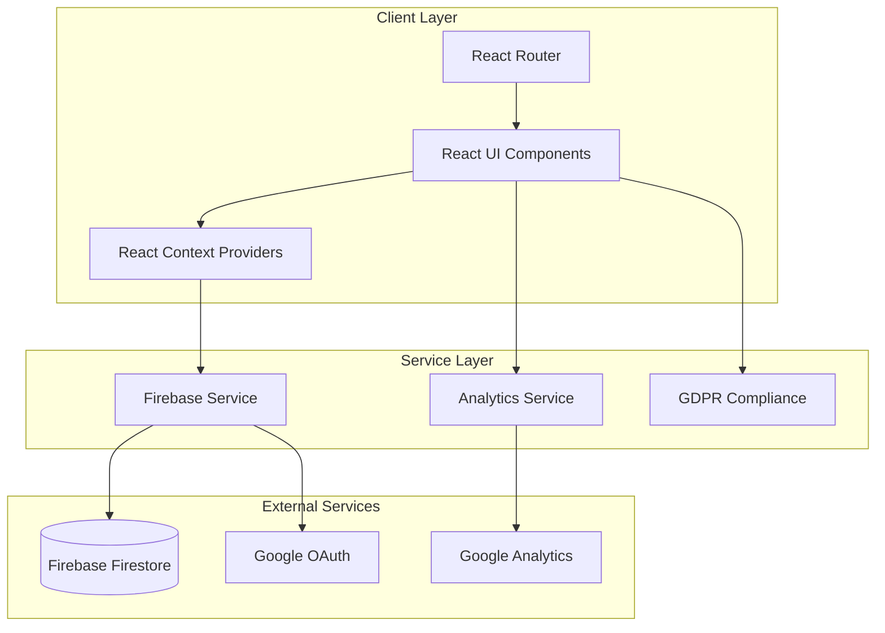

# Design Document

## Overview

The Video File Size Calculator is a React-based web application that provides professional-grade video file size calculations for the media industry. The system features a public calculator interface for end users and a secure admin interface for managing codec data and system configuration. The application uses Firebase Firestore for data persistence and Google OAuth for admin authentication.

## Architecture

### High-Level Architecture



### Component Architecture

The application follows a hierarchical component structure with clear separation of concerns:

- **App Component**: Root component managing routing and global providers
- **Context Providers**: Manage global state for codecs, authentication, and presets
- **Page Components**: Calculator, Admin, About, CodecData, PrivacyPolicy
- **Feature Components**: Specialized components for specific functionality
- **Utility Components**: Reusable UI components and helpers

### Data Flow

1. **Application Initialization**: Load codec data and default presets from Firebase Firestore with localStorage fallback
2. **User Interaction**: User selects codec parameters through UI with automatic calculation on each change
3. **Auto-Calculation**: System automatically calculates and displays file size on any parameter change
4. **Preset Application**: User clicks preset to auto-apply configuration and calculate results
5. **State Management**: React Context manages application state with real-time updates
6. **Persistence**: Admin changes to codecs and default presets are saved to Firebase Firestore
7. **Analytics**: User interactions are tracked via Google Analytics

## Components and Interfaces

### Core Components

#### Calculator Component
- **Purpose**: Main interface for file size calculations
- **Key Features**:
  - Codec selection with cascading dropdowns and auto-calculation
  - Duration input with validation and real-time calculation
  - Automatic calculation on any parameter change
  - Preset management with auto-calculation on preset selection
  - URL sharing functionality
- **State Management**: Uses CodecContext and PresetContext
- **Responsive Design**: Mobile-first approach with collapsible navigation
- **Auto-Calculation**: Triggers calculation immediately on any UI interaction

#### Admin Component
- **Purpose**: Secure administrative interface
- **Key Features**:
  - Google OAuth authentication
  - Individual codec CRUD operations in Firebase Firestore
  - Enhanced codec database management with real-time updates
  - Default preset management in Firebase Firestore
  - Data import/export functionality
  - Analytics configuration
- **Security**: Role-based access control with email whitelist
- **Data Management**: Direct Firebase integration for individual codec and preset CRUD operations
- **Real-time Updates**: Immediate reflection of changes in user interface

#### Firebase Service
- **Purpose**: Centralized Firebase operations
- **Key Methods**:
  - `getCategories()`: Fetch codec data
  - `importCodecData()`: Bulk data import
  - `signInWithGoogle()`: Admin authentication
  - `testConnection()`: Connection validation
- **Error Handling**: Comprehensive error handling with fallback mechanisms
- **Caching**: Local storage fallback for offline functionality

### Context Providers

#### CodecContext
- **State**: Categories, loading status, error state
- **Methods**: Update, refresh, reset, import/export
- **Data Structure**: Hierarchical codec organization (Category → Codec → Variant)
- **Caching**: Local storage for offline access

#### PresetContext
- **State**: Custom presets, sync status
- **Methods**: Add, update, delete, reset presets
- **Persistence**: Local storage with admin defaults
- **Synchronization**: Real-time updates from admin changes

#### AuthContext
- **State**: User authentication status
- **Methods**: Sign in, sign out
- **Integration**: Google OAuth with Firebase Auth
- **Security**: Email-based authorization

## Data Models

### Codec Data Structure

```typescript
interface CodecCategory {
  id: string;
  name: string;
  description?: string;
  codecs: Codec[];
}

interface Codec {
  id: string;
  name: string;
  description?: string;
  workflowNotes?: string;
  variants: CodecVariant[];
}

interface CodecVariant {
  name: string;
  description?: string;
  bitrates: {
    [resolution: string]: {
      [frameRate: string]: number; // Mbps
    } | number; // Fallback format
  };
}
```

### Preset Data Structure

```typescript
interface CustomPreset {
  id: string;
  name: string;
  category: string;
  codec: string;
  variant: string;
  resolution: string;
  frameRate: string;
}
```

### Firebase Document Structure

```typescript
interface FirebaseCodecDocument {
  id: string;
  name: string;
  description: string;
  workflowNotes: string;
  category: string;
  category_id: string;
  variants: Array<{
    name: string;
    description: string;
    bitrates: object;
  }>;
  firebase_created_at: string;
  firebase_updated_at: string;
  source: string;
}

interface FirebaseDefaultPresetDocument {
  id: string;
  name: string;
  category: string;
  codec: string;
  variant: string;
  resolution: string;
  frameRate: string;
  order: number;
  isActive: boolean;
  firebase_created_at: string;
  firebase_updated_at: string;
  created_by: string;
}
```

## Error Handling

### Client-Side Error Handling

1. **Component Error Boundaries**: Catch and display React component errors
2. **Network Error Handling**: Graceful degradation when Firebase is unavailable
3. **Validation Errors**: User-friendly messages for invalid inputs
4. **Loading States**: Clear feedback during data fetching operations

### Firebase Error Handling

1. **Connection Failures**: Fallback to cached data
2. **Authentication Errors**: Clear error messages and retry mechanisms
3. **Permission Errors**: Appropriate access denied messages
4. **Data Validation**: Server-side validation with client feedback

### Admin Interface Error Handling

1. **Import Validation**: Comprehensive file format validation
2. **Export Failures**: Error reporting with retry options
3. **Authentication Failures**: Clear OAuth error messages
4. **Data Corruption**: Backup and recovery mechanisms

## Testing Strategy

### Unit Testing
- **Components**: Test individual component functionality
- **Services**: Test Firebase service methods
- **Utilities**: Test calculation logic and helper functions
- **Context Providers**: Test state management logic

### Integration Testing
- **Firebase Integration**: Test data flow between client and Firebase
- **Authentication Flow**: Test OAuth integration
- **Calculation Accuracy**: Verify file size calculations
- **URL Sharing**: Test shareable link generation and parsing

### End-to-End Testing
- **User Workflows**: Test complete user journeys
- **Admin Workflows**: Test administrative functions
- **Mobile Responsiveness**: Test mobile device compatibility
- **Cross-Browser Compatibility**: Test across different browsers

### Performance Testing
- **Load Times**: Measure application startup performance
- **Calculation Speed**: Test calculation response times
- **Firebase Performance**: Monitor database query performance
- **Bundle Size**: Optimize JavaScript bundle size

## Security Considerations

### Authentication Security
- **OAuth Integration**: Secure Google OAuth implementation
- **Session Management**: Secure session storage and expiration
- **Email Verification**: Whitelist-based admin access control
- **Token Handling**: Secure Firebase token management

### Data Security
- **Firestore Rules**: Proper read/write permissions
- **Input Validation**: Sanitize all user inputs
- **XSS Prevention**: Proper output encoding
- **CSRF Protection**: Secure form submissions

### Privacy Compliance
- **GDPR Compliance**: Cookie consent and data processing transparency
- **Analytics Opt-out**: User control over tracking
- **Data Minimization**: Collect only necessary data
- **Privacy Policy**: Clear data usage documentation

## Performance Optimization

### Frontend Optimization
- **Code Splitting**: Lazy load admin interface
- **Bundle Optimization**: Tree shaking and minification
- **Caching Strategy**: Aggressive caching of codec data
- **Image Optimization**: Optimized assets and icons

### Backend Optimization
- **Firebase Optimization**: Efficient Firestore queries
- **Caching Strategy**: Local storage for frequently accessed data
- **Connection Pooling**: Optimize Firebase connections
- **Data Structure**: Efficient document organization

### Mobile Optimization
- **Responsive Design**: Mobile-first CSS approach
- **Touch Optimization**: Touch-friendly interface elements
- **Performance**: Optimized for mobile networks
- **Progressive Web App**: PWA features for mobile experience

## Deployment Architecture

### Build Process
- **Vite Build System**: Fast development and production builds
- **Environment Configuration**: Separate configs for dev/prod
- **Asset Optimization**: Automatic asset optimization
- **TypeScript Compilation**: Type checking and compilation

### Hosting Strategy
- **Github pages deployment**: Static site for the front end on github pages
- **Environment Variables**: Secure configuration management in github secrets
- **Domain Configuration**: Custom domain with SSL through github pages
- **Redirect Rules**: Proper SPA routing support on github pages

### Monitoring and Analytics
- **Google Analytics**: User behavior tracking
- **Error Monitoring**: Client-side error tracking
- **Performance Monitoring**: Core Web Vitals tracking
- **Usage Analytics**: Feature usage statistics